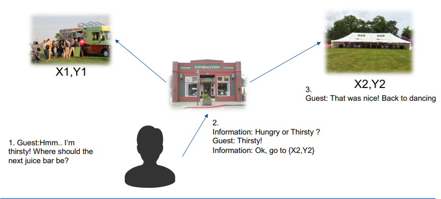
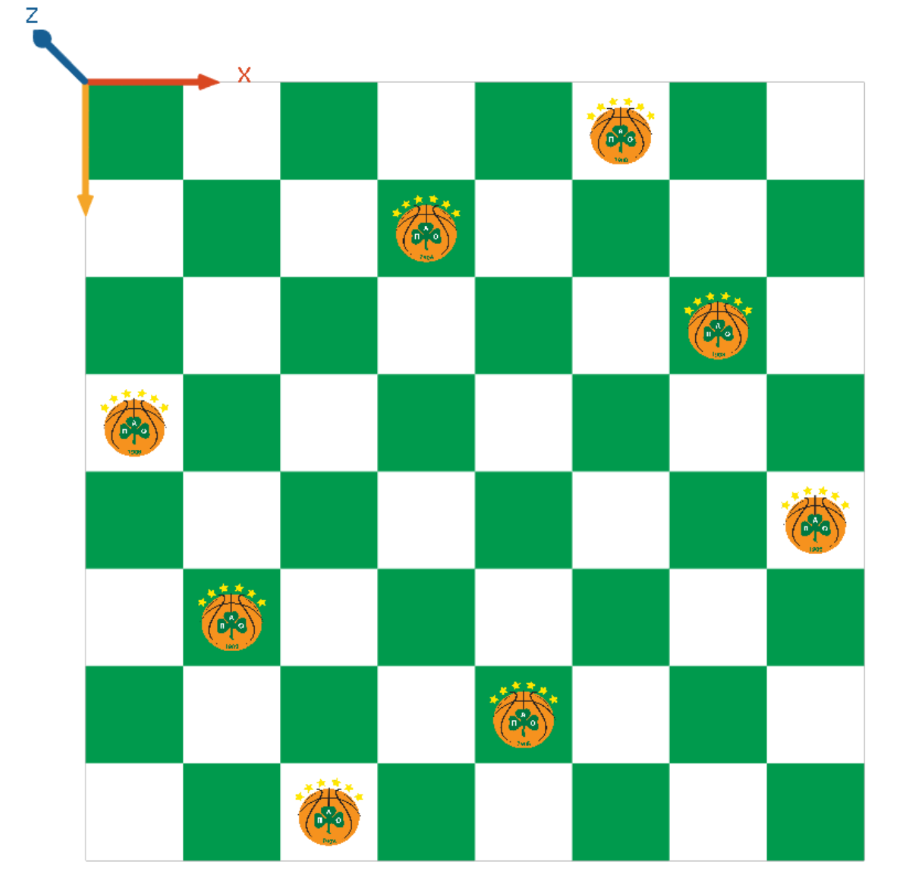

# Distributed Artificial Intelligence
Distributed Artificial Intelligence Course @KTH
 

# Assignment 1

Distributed Artificial Intelligence Course, First Assignment @KTH
 
 
A simulation of a Festival with 3 types of agents: Guests, Stores and an Information Center.
 

 
Festival1.gaml: Implementation of the basic part of the assignment.
 
 
Festival2.gaml: Challenge 1 - Memory of agents/Brain
 
When an agent visits a shop, they will remember the position. However, 
sometimes they would like to discover new places as well.
 
 
Festival3.gaml: Challenge 2 - Removing Bad Behaviour Agents
 
A new agent (Security Guard) is created  who kills the bad agents.
 
 
Festival4.gaml: Extra effort - Find the closest shop

# Assignment 2

Implementation of 3 types of auctions: 
* Dutch auction
* English auction
* Sealed-bid auction

# Assignment 3

 

* FestivalSpeakers.gaml: solving N Queen Problem

* UtilityStages.gaml: Basic festival
* UtilityStagesCrowdMass.gaml: Introverts and extroverts added, introverts tend to prefer less crowded compared to the extroverts 
* UtilityStagesSquidGame.gaml: Squid Game Festival, a special type of festival
